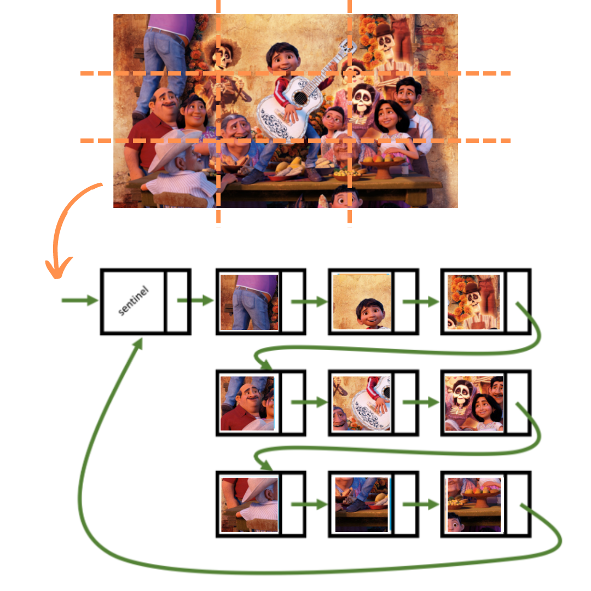
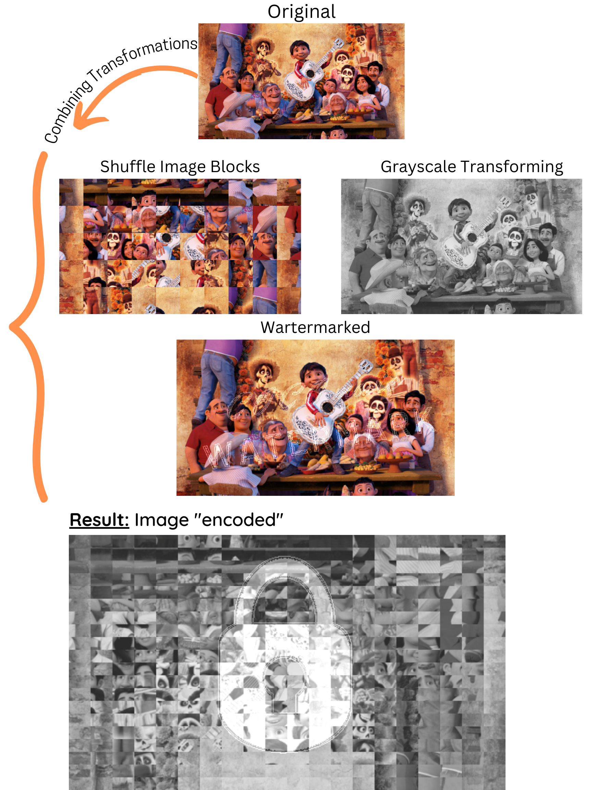

# Image_Manipulation

### Introduction

Image Manipulation is my personal project which main features is to change the color of the image and rearrange the smaller image blocks of the original image to create interesting visual effects.

Besides that, I have also created a simple image encoding feature that breaks the original image into small blocks, shuffles these blocks and watermarks it.

---

### Table of content

* Approach
* Main Features
* Demo
* Installation
* Credit

---

### Approach

* The color changing and image visual effects: Traversing all pixels of image and adjusting pixel's RGBA channels according to each image manipulation feature.
* Manipulating on smaller image blocks: Splitting an image into smaller blocks and rearranging those blocks by singly linked lists with a sentinel node as a head node. When blocks change their positions, an image will be reassembled by changing RGBA pixels to create visual results.

  Each image Block is placed into a Node of a chain, as shown below:

  

---

### Main Features

Colors transforming

* Transforming an image to **grayscale**
* Transforming an image with a **spotlight centered**
* Transforming an image according to **two given colors**
* Adding **watermark** for an image

Image blocks transition

* **Reverses** the order of image blocks
* **Shuffles** the order of image blocks
* **Encoding** the original given image by using shuffle, grayscale, watermark features

---

### Demos




---

### Installation

Open Terminal console in the project folder and take the following steps:

```
# Step 1: compiles Make file
$ make
# Step 2: run the code base
$ /pa1
```

---

### Credits

The project's core code base is a part of lab materials from the Algorithms and Data Structures - CPSC 221 course at University of British Columbia. I used pre-built classes and functions which play a role to manipulate with image PNG, image pixel, RGBA channels, break image into small blocks and attach blocks to become a chain.
Image source: CoCo - Pixar
