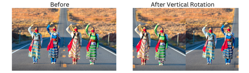

# Image_Manipulation

This project is a part of Algorithms and Data Structures course at UBC. The primary approach for image manipulation is to splits an image into smaller blocks and rearrange those blocks by linked lists.
When blocks change their positions, an image will be reassembled by changing RGB pixels to create visual results

To implement features, the project applied 2D vectors, linked lists and management of dynamic memory.

### Demo results

### Note
This project is still in progress to add more features such as horizontal rotation and flip image 
blocks